# Avi Coin

A cryptocurrency, built from scratch in Rust.

Not a wrapper around a Bitcoin library — there is no Bitcoin library here. The
peer-to-peer protocol, the block and transaction formats, the script interpreter,
the proof-of-work miner, the reorg logic, the wallet and its signatures are all
written out from public documentation such as [bitcoin.org](https://bitcoin.org/),
**without reading Bitcoin's source code**. That constraint is the whole point:
you cannot copy your way to understanding why a design is the way it is.

It works. Nodes find each other, mine, agree, disagree and re-agree, and you can
send someone coins.

<picture>
  <source media="(prefers-color-scheme: dark)" srcset="docs/img/dashboard-dark.svg">
  
</picture>

That is the block explorer every node serves, drawn from a real run — the
heights, the hashes and the two payments crossing the mempool are a node's own,
read over its API by [`docs/img/make-dashboard-svg.py`](docs/img/make-dashboard-svg.py).
The intervals are flat at one second because that is the test network's target
and difficulty is holding it.

## What it actually does

Run one and you have a real node. It will:

- **mine** — grind SHA-256 for a block that beats the current target, and collect
  the 50 AVI subsidy plus fees when it finds one;
- **find peers** — dial the addresses you gave it, then learn where everyone
  else's peers listen and dial those too, so a network converges from a single
  introduction;
- **sync** — ask a new peer for headers first, walk back to the block you both
  already know, then fetch only the bodies it is missing;
- **agree** — accept a block only if every rule holds: the work, the difficulty
  the retarget rule demands, the timestamp, the merkle root, and a signature and
  a script run for every input being spent;
- **disagree, then re-agree** — when someone turns up with a heavier chain, undo
  its own blocks one at a time, put the coins they spent back exactly as they
  were, and apply the other chain. Payments from the undone blocks go back to the
  mempool if they are still valid;
- **survive being killed** — pull the plug mid-block and it restarts on the last
  block it fully committed, never half of one;
- **show you all of it** — a block explorer at `http://localhost:8080`, with a
  JSON API underneath it.

And a wallet, in a separate command, so the node holding the chain never holds
the authority to spend from it.

## Try it in two minutes

```bash
cargo run -- --network=test --api-address 127.0.0.1:8080 --mine
```

Open <http://localhost:8080>. The test network wants a block a second, so the
height climbs while you watch, the interval bars show the rhythm, and the log
streams what the node is thinking.

For a network rather than a single node:

```bash
docker compose up
```

Three nodes, one mining and two syncing from it — viewer on
<http://localhost:8080>.

## Sending coins

The node has the chain; a separate command has the key. There is **no
`POST /send`** on the API and there never will be — spending authority behind a
public URL is the one thing a node must not offer.

```bash
cargo run -- send --to <address> --amount 1.5 --api-address 127.0.0.1:8080
```

That reads the key off disk, asks the node what there is to spend, builds and
signs the transaction locally, and hands the node something any stranger could
have handed it. It prints a txid.

## Joining somebody else's network

```bash
cargo run -- --addresses-to-connect <host>:34352 --api-address 127.0.0.1:8080
```

Your node syncs from theirs, and the viewer shows it catching up. Add `--mine` to
mine against their chain; difficulty adapts to whatever hashrate turns up, which
is easier to watch than to be told.

## Status

**v1 is built.** All seven milestones are delivered — a node mines, validates and
relays blocks, reorganises onto the heavier chain, keeps a mempool, spends coins
from a wallet, survives a kill at any point, and serves a block explorer over
HTTP. **[ADR-0001](docs/adr/0001-v1-scope.md)** is what v1 meant, and its
[v1, as delivered](docs/adr/0001-v1-scope.md#v1-as-delivered) section is what came
out — including the three things that came out differently.

| # | Milestone | |
|---|---|---|
| M1 | Node foundations — shared state, per-peer reader/writer threads | ✅ |
| M2 | Peer handshake & discovery — `version` / `verack` / `addr` | ✅ |
| M3 | Transactions end-to-end — Script VM, addresses, UTXO set, mempool, relay | ✅ |
| M4 | Mining, consensus & block relay — coinbase, retarget, reorg | ✅ |
| M5 | Persistence — block files, undo data, crash recovery | ✅ |
| M6 | HTTP API & web block explorer | ✅ |
| M7 | Deploy & multi-node end-to-end tests | ✅ — but for the deployment |

**Nothing public is running yet.** Everything a public node needs is in
[`deploy/`](deploy/) — one `docker compose up -d` on a host with a name — and
[#127](https://github.com/matheusavi/avicoin/issues/127) is where that stands.
Until somebody runs it, the networks you can join are the ones you start.

The work itself is tracked in
[GitHub milestones and issues](https://github.com/matheusavi/avicoin/milestones),
not in this file.

Built means built, not production-grade: this is a learning project, the coin has
no value, and the wallet key sits in plaintext on disk. The
[disclaimer](#disclaimer) is not boilerplate.

**Deliberately out of scope for v1:** a terminal UI, Script beyond the shipped
opcode set, sighash types other than ALL, timelocks and RBF, block pruning, and
network performance work. Each is a documented decision rather than an oversight,
and each is a second act rather than a gap.

## The design decisions worth reading

Five places where this deliberately is not Bitcoin, each with a reason:

- **Coins are locked by a Script program**, evaluated by a small stack VM. An
  output names a *predicate*, not an identity — anything that can satisfy the
  program can spend the coin.
- **The unlocking data sits in a witness the txid does not cover**, so a txid
  cannot be malleated. The merkle root is then built over witness-*including*
  hashes, which makes Bitcoin's entire SegWit apparatus — script versioning, the
  coinbase witness commitment — unnecessary. Bitcoin needed all of it because
  SegWit had to be a soft fork on a live chain; a new chain does not.
- **The sighash is just the txid.** Once the witness sits outside the hashed
  form, the circularity that forces Bitcoin's "blank out the signature slots"
  dance never arises.
- **Difficulty retargets every block** from a moving 60-block window rather than
  in 2016-block steps. A chain running on very little compute dies if a visiting
  miner leaves mid-window; this one absorbs a thousandfold change in tens of
  blocks.
- **~2,016,000 AVI**, 50 per block, halving weekly, **no premine**.

Start at [ADR-0002](docs/adr/0002-output-locking-model.md) and read forward.

## How it is built

Threads and channels, no async runtime. One mutex over the node's whole state,
and a hard rule that nothing holds it across anything slow — not a socket write,
not `println!`, not a signature check. Each peer gets a reader thread and a
writer thread over one connection; the writer owns every write, and the peer
table holds each peer's only sender, so dropping a peer *is* disconnecting it.

Dependencies stay at generic plumbing. ECDSA is RustCrypto's `k256`, never
`rust-secp256k1`, which wraps Bitcoin Core's own library. HTTP is hand-rolled,
after the crate that was there turned out to bound nothing a stranger could
drive.

[docs/ARCHITECTURE.md](docs/ARCHITECTURE.md) has the module map and the
invariants.

## Documentation

| | |
|---|---|
| [ADR-0001 — v1 scope](docs/adr/0001-v1-scope.md) | What was built and why it is this size. Start here. |
| [Architecture](docs/ARCHITECTURE.md) | Design, concurrency model, invariants, module map. |
| [Decision records](docs/adr/) | Every significant decision, its options, and its consequences. |
| [Glossary](docs/glossary.md) | One term, one meaning — across code, docs, and conversation. |
| [HTTP API](docs/api.md) | Every endpoint and the shape it answers with. |
| [On-disk format](docs/on-disk-format.md) | What a node writes, so a file can be decoded without the code. |
| [Deployment](docs/deployment.md) | The container, the volume, the healthcheck. |

## Building and testing

```bash
cargo build                                  # debug binary at target/debug/avicoin
cargo test                                   # unit tests
cargo clippy --all-targets -- -D warnings    # what CI's lint job runs
```

There is a second suite that needs a *running* node — it launches the binary and
speaks the protocol to it over a socket:

```bash
python3 -m venv .venv && .venv/bin/pip install -r requirements.txt
.venv/bin/python -m pytest test/functional
```

Its message encoder is a deliberate second implementation, so a bug symmetric
across encode and decode still gets caught.

## Configuration

With no `config.toml` and no arguments, a node listens on `127.0.0.1:34352` on
the main network with no peers — a valid standalone node that others can dial.
`config.toml` is optional and so is every field in it; CLI flags override both:

```bash
cargo run -- --host-address 127.0.0.1:34352 \
             --addresses-to-connect 127.0.0.1:5000 \
             --addresses-to-connect 127.0.0.1:5001
```

`--network=test` is a different chain rather than a flag on this one: it selects
a different genesis block, and wants a block a second instead of one every
thirty.

## Running in a container

```bash
docker build -t avicoin .
docker run -d -p 34352:34352 -p 8080:8080 -v avicoin-data:/avicoin/data avicoin \
  --data-dir=/avicoin/data --host-address=0.0.0.0:34352 \
  --api-address=0.0.0.0:8080 --mine
```

[docs/deployment.md](docs/deployment.md) has the rest; [deploy/](deploy/) is the
public node's own recipe.

## Disclaimer

This project is purely for **learning purposes**. It is **not** intended for
real-world use, and it does not match Bitcoin in security or in features.

**The wallet's private key is stored in plaintext**, in `wallet.key` inside the
node's data directory, at mode `0600` on Unix. (On other platforms the file
inherits whatever permissions the directory gives it, and the node does not
pretend otherwise.) Anyone who can read that file can spend everything the key
holds. Do not put anything on this chain you would mind losing — which should be
easy, since the coin is worth nothing.
